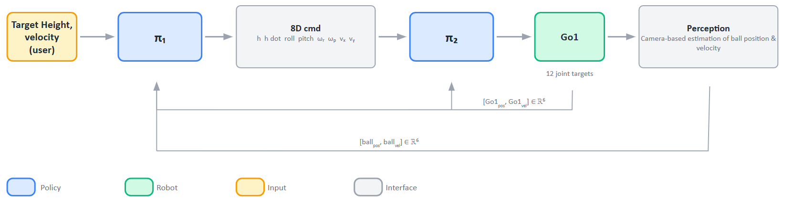
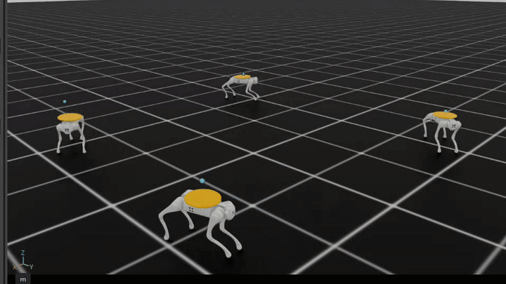
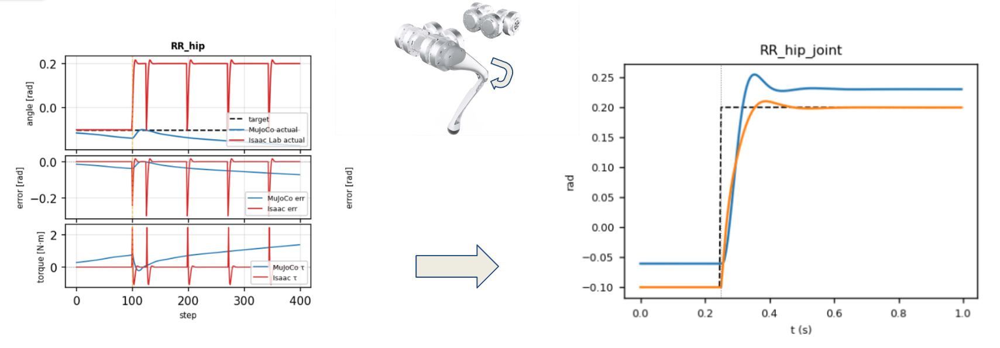
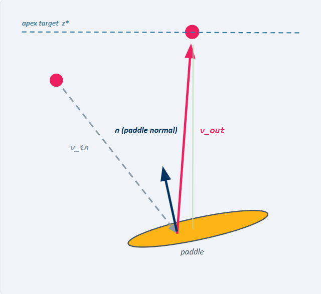

# Hierarchical Quadrupedal Juggling

A UC Berkeley MEng Mechanical Engineering capstone on making a Unitree Go1 bounce a ping-pong ball on a back-mounted paddle by combining a reusable RL torso tracker with an interpretable planner.

<p align="center">
  
</p>

<p align="center"><em>Analytic mirror-law planner plus the trained pi2 torso tracker in MuJoCo, six-second forward-walk-and-juggle segment.</em></p>

## The idea

Juggling is a compact test of legged manipulation: the robot must manage contact timing, ball energy, body pose, and motion at once. Rather than learn the full behavior as one opaque policy, this project separates the problem into a high-level planner and a learned low-level tracker. That makes the task easier to inspect, tune, and move between simulators.

<p align="center">
  
</p>

- **pi1 planner:** consumes ball state and user targets, then produces a six-dimensional torso command: height, height rate, roll, pitch, roll rate, and pitch rate. Two variants were built: an analytic mirror law and a learned PPO planner.
- **pi2 torso tracker:** a PPO policy with an MLP `[256, 128, 64]` that maps the torso command and robot state to 12 joint targets. Its committed 39D-to-12D ONNX export is used in the demo.
- **Task stack:** Isaac Lab environments cover static ball balance, torso tracking, and the hierarchical ball-juggling task. The repository also includes ROS perception prototypes and deployment investigation.

<p align="center">
  
</p>

<p align="center"><em>Isaac Lab, cropped to the four-robot simulation viewport. This six-second GIF uses 31-37 seconds of the original recording.</em></p>

## What is demonstrated

- **Reusable pi2 policy:** `sim_to_real/unitree_bringup/config/go1/pi2.onnx` is a committed 39D-to-12D torso-tracking export. The bounded MuJoCo smoke test below loads it and runs 20 policy steps.
- **Tuned Isaac Lab to MuJoCo transfer:** the committed GIF above demonstrates the analytic mirror law plus pi2 in MuJoCo. The transfer is deliberately described as tuned: pi2 action magnitude is reduced to 20%, torso commands are clamped, and roll/pitch-rate commands are zeroed.
- **Cross-simulator validation:** fixed-base joint comparisons, recorded golden cases, and a documented reindexing investigation separate policy-loading errors from physics mismatch. The golden actor cases reproduce to approximately `5e-6` according to the [debug record](docs/sim_to_sim_debug_log.md).

<p align="center">
  
</p>

<p align="center"><em>Fixed-base joint step response. The runtime mapping is derived from MJCF actuator names rather than a handwritten permutation.</em></p>

The key transfer bug was a reversed joint reindex. Isaac Lab groups joints by type while the MJCF groups them by leg; treating the mapping as a gather made a default pose appear up to 2.5 rad wrong. The correction is the scatter operation `isaac[reindex] = mjcf` in [scripts/mujoco_utils.py](scripts/mujoco_utils.py).

## Limitations

- A learned pi1 PPO policy, reward structure, and training entrypoint are implemented, but no converged pi1 checkpoint, training log, or successful learned-pi1 video is committed.
- ROS 1/ROS 2 perception prototypes perform HSV ball detection, depth back-projection, and Kalman-filtered state estimation. They are not connected to a trained visual policy.
- The deployment investigation exported pi2 to ONNX and found that the stock Unitree controller accepts a 3D velocity command rather than the hierarchy's 6D torso command. No hardware rollout is claimed.
- There is no verified domain-randomization result or balance-under-locomotion result in this repository.

<p align="center">
  
</p>

<p align="center"><em>The mirror law uses ball state and desired apex energy to select a paddle orientation; it is the planner used in the committed MuJoCo demo.</em></p>

## Reproduce the MuJoCo smoke test

```bash
python3.11 -m venv .venv
. .venv/bin/activate
pip install -r requirements.txt

git clone https://github.com/Improbable-AI/walk-these-ways.git ../walk-these-ways
export GO1_ACTUATOR_NET="$PWD/../walk-these-ways/resources/actuator_nets/unitree_go1.pt"

python scripts/play_mujoco_mirror_paper.py --headless --max_steps 20
```

The actuator network is intentionally not vendored; it comes from the MIT-licensed [Walk These Ways](https://github.com/Improbable-AI/walk-these-ways) project. Isaac Lab training additionally needs Isaac Lab 2.3.2 / Isaac Sim 5.1, an NVIDIA GPU, and [`requirements-isaaclab.txt`](requirements-isaaclab.txt). Script-specific requirements are stated at the top of each file.

## Project context and team

Developed as the Agile Quadrupeds Group 164 capstone in the [UC Berkeley Master of Engineering](https://funginstitute.berkeley.edu/programs-centers/full-time-program/) program, Mechanical Engineering, with the Hybrid Robotics Lab and advisor Prof. Koushil Sreenath and Post Doc advisor Sangli Teng.

This is joint work by [Daniel Grant](https://github.com/DJRGVC), Jaime de Carlos de Churruca, and Siqi (Frank) Wang. Daniel led the original Isaac Lab environment and task definitions. Frank led the hierarchical pi1-pi2 controller, pi2 training/export, Isaac Lab-to-MuJoCo transfer and validation, perception prototype, and deployment investigation. Jaime contributed to the project’s system design and mirror-law-planner work. The original repository is [QuadruJuggle](https://github.com/DJRGVC/QuadruJuggle).

For the complete project record, see the [capstone report](<docs/capstone_report.pdf>), [presentation deck](<docs/presentation_deck.pdf>), and [sim-to-sim debugging record](docs/sim_to_sim_debug_log.md). The earlier [February 2026 status report](QuadruJuggle_Research_Overview.pdf) is retained for timeline context but is partly superseded by later work.

Related technical context: Poggensee et al., *Ball Juggling on the Bipedal Robot Cassie* (ECC 2020); Schulman et al., *Proximal Policy Optimization Algorithms* (2017); and Margolis & Agrawal, *Walk These Ways* (CoRL 2023).
