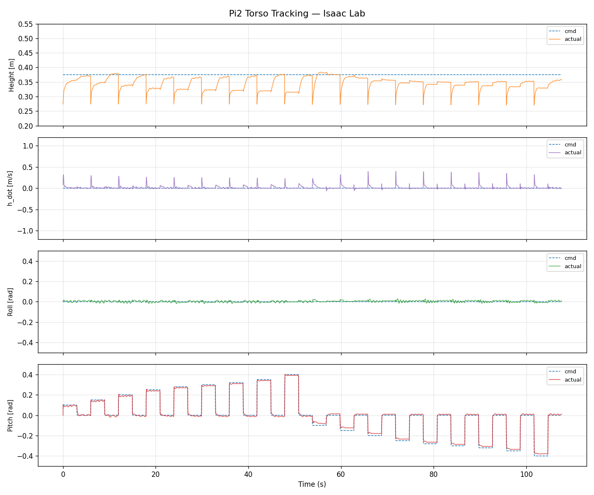
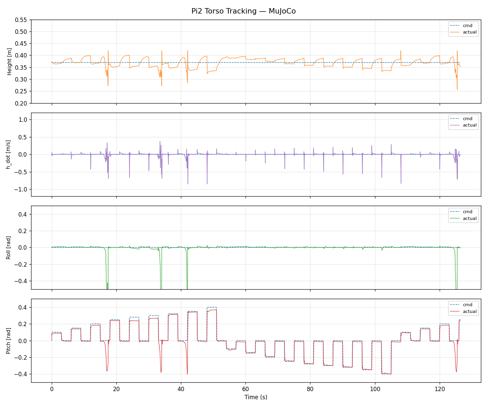
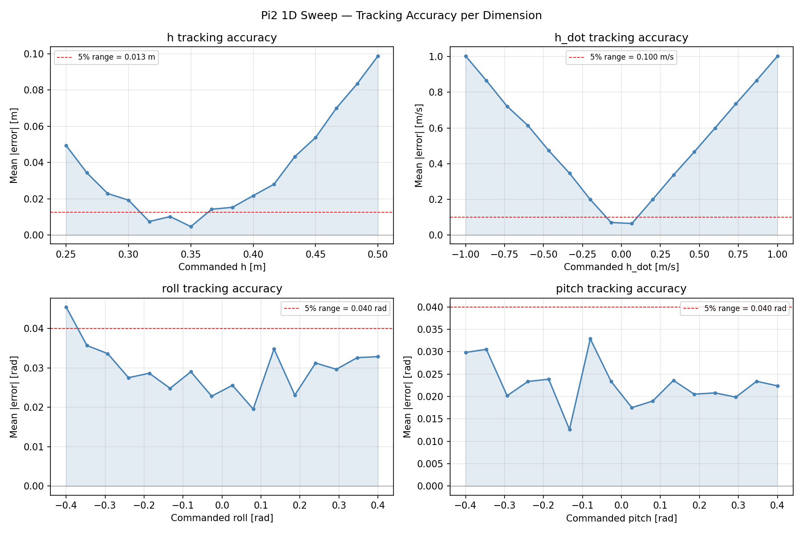
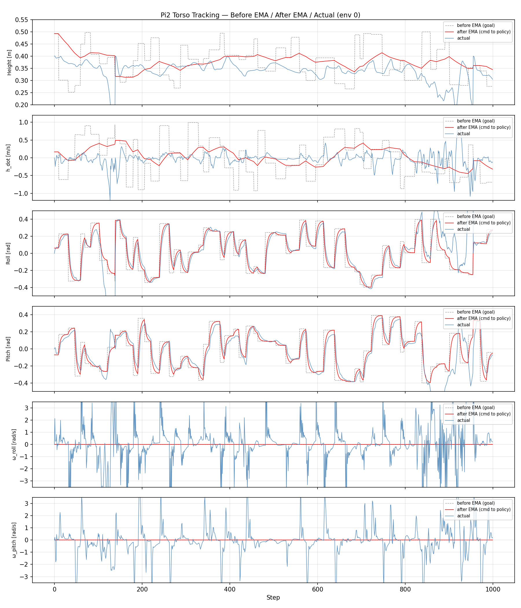
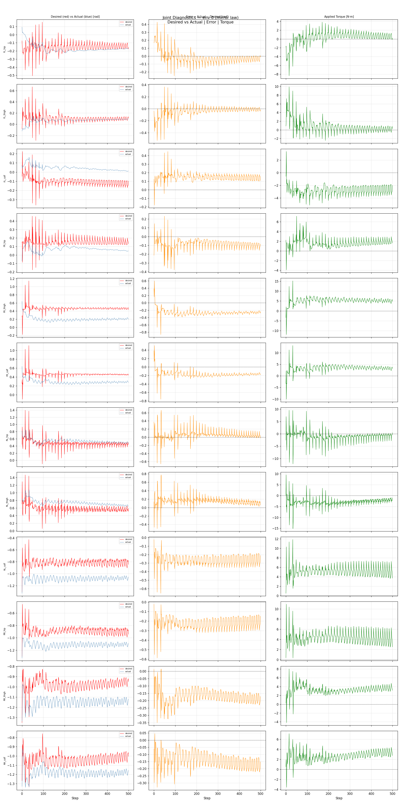
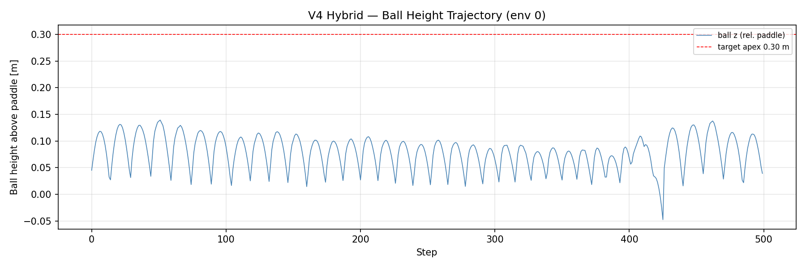
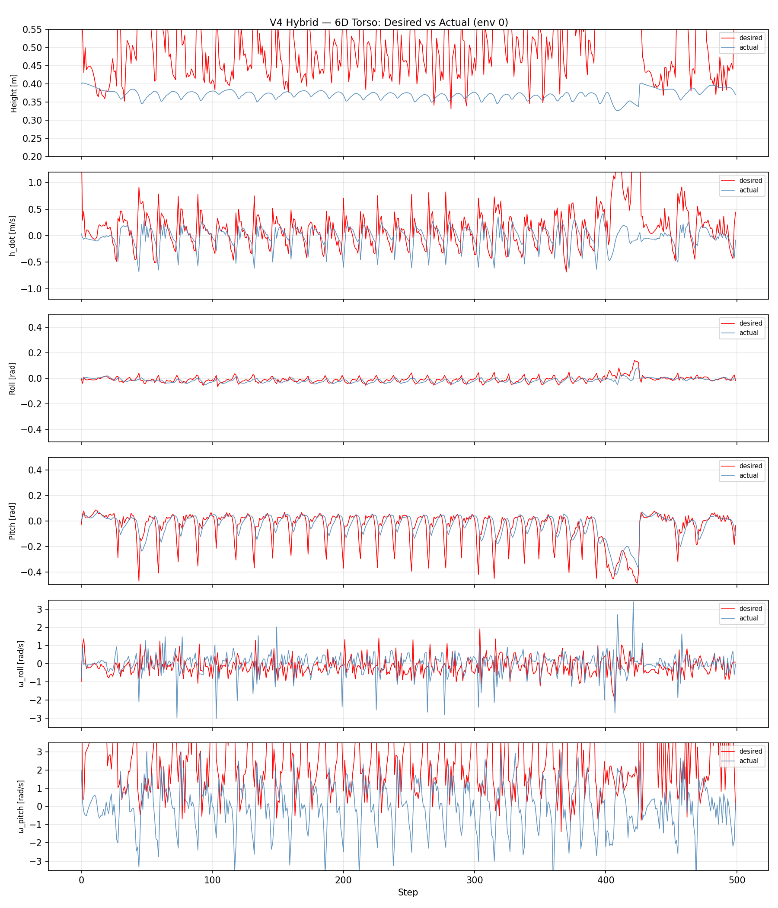
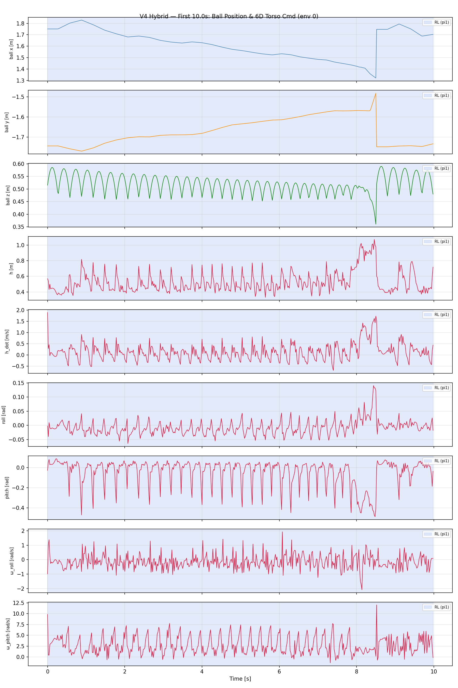
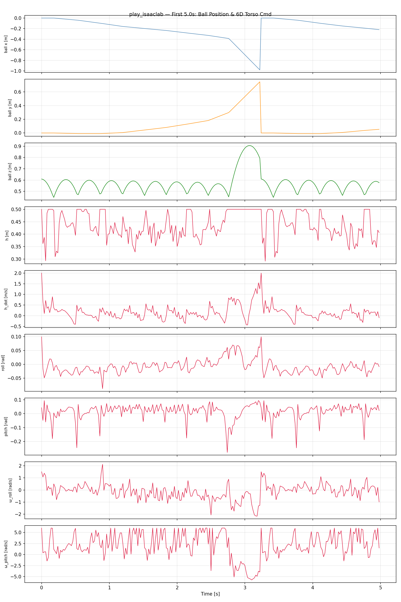

# Diagnostics

These artifacts document the engineering process and failure modes; they are not additional performance claims.

## Pi2 tracking and transfer

Isaac Lab command-versus-actual traces: pitch tracks relatively closely, while height remains oscillatory and below the command.

MuJoCo command-versus-actual traces: pitch often follows, while height oscillates and roll has large excursions.

The pi2 sweep shows that only parts of the tested command range meet the plotted 5% error threshold.

The before/after EMA trace retains residual mismatch and late instability.

[MuJoCo mirror-law playback](../videos/mujoco_mirror_paper_latest.mp4)

This 10-second MuJoCo capture shows the analytic mirror law plus pi2 repeatedly bouncing the ball; it is not learned-pi1 evidence.

## Mirror-law joint behavior

The 12-joint desired/actual/error/torque grid shows persistent tracking error.

## Hierarchical-controller diagnostics

The trajectory misses its 0.30 m apex target, with most peaks around 0.05-0.15 m and repeated drops below the paddle.

Desired-versus-actual torso channels show noise, saturation, and mismatch.

Despite its filename, this plot covers roughly 10 seconds; ball height decays and resets near 9 seconds.

## Isaac Lab ball trace

This five-second ball-position and command trace includes resets and is a debugging artifact rather than a successful episode capture.
